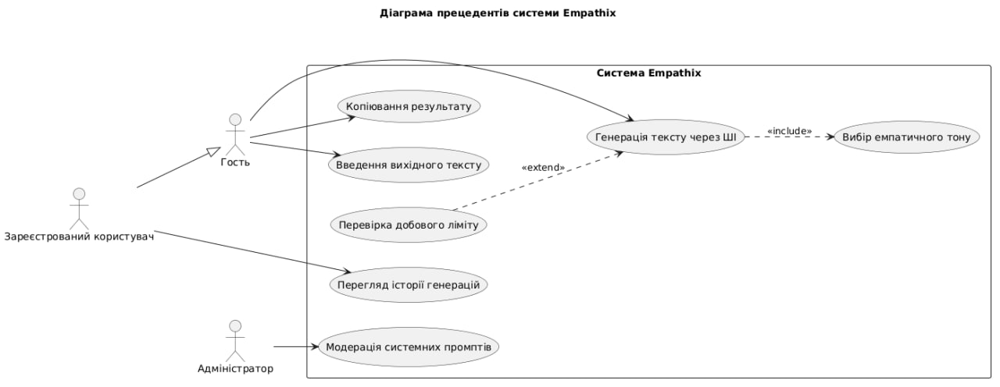
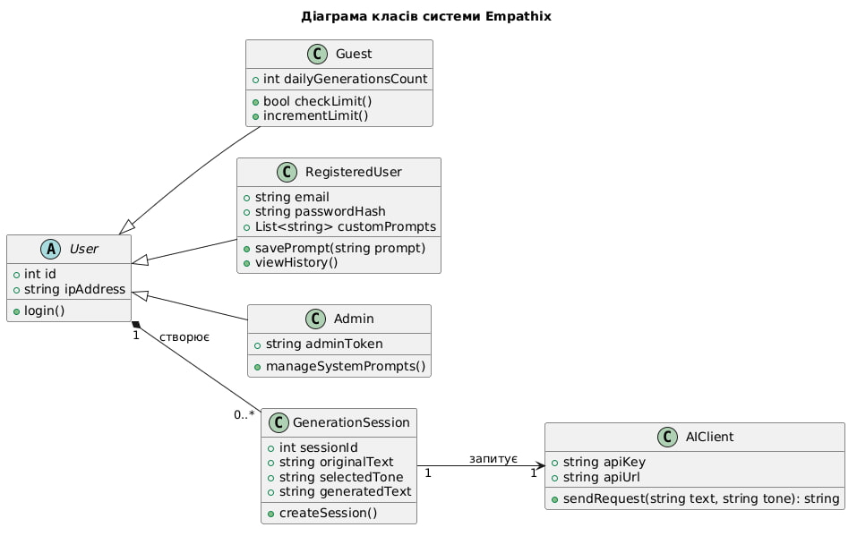
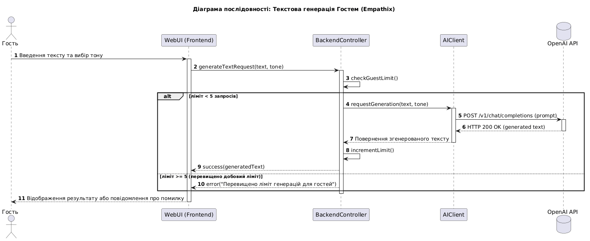

# Проєкт Empathix

## Діаграми

### 1. Діаграма прецедентів (Use Case Diagram)
*Розробник: Данило Молчанов*

### 2. Діаграма класів (Class Diagram)
*Розробник: Артем Чарияров*

### 3. Діаграма послідовності (Sequence Diagram)
*Розробник: Рустам Рапій*

## Матриця трасовності
*Розробник: Рустам Рапій*

| ID | Функціональна вимога | Прецедент | Класи | Послідовність |
| :--- | :--- | :--- | :--- | :--- |
| **FR-01** | Введення тексту | UC-01 | `User`, `Guest` | SD-01 |
| **FR-02** | Вибір емпатичного тону | UC-02 | `GenerationSession` | SD-01 |
| **FR-03** | Копіювання результату | UC-03 | `GenerationSession` | — |
| **FR-04** | Обмеження Гостя | UC-04 | `Guest` | SD-01 |
| **FR-05** | Реєстрація/Авторизація | UC-05 | `RegisteredUser` | — |
| **FR-07** | Перегляд історії | UC-07 | `RegisteredUser` | — |
| **FR-11** | Взаємодія з API | UC-11 | `AIClient` | SD-01 |